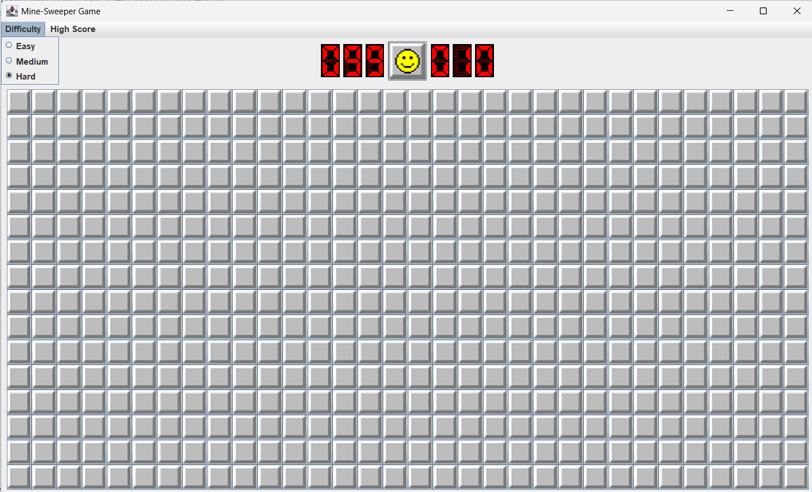
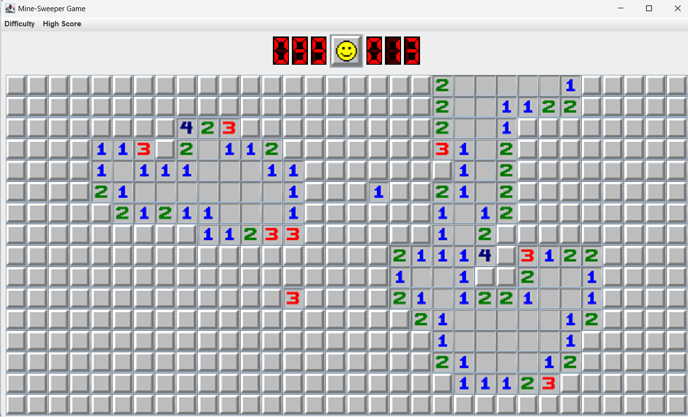
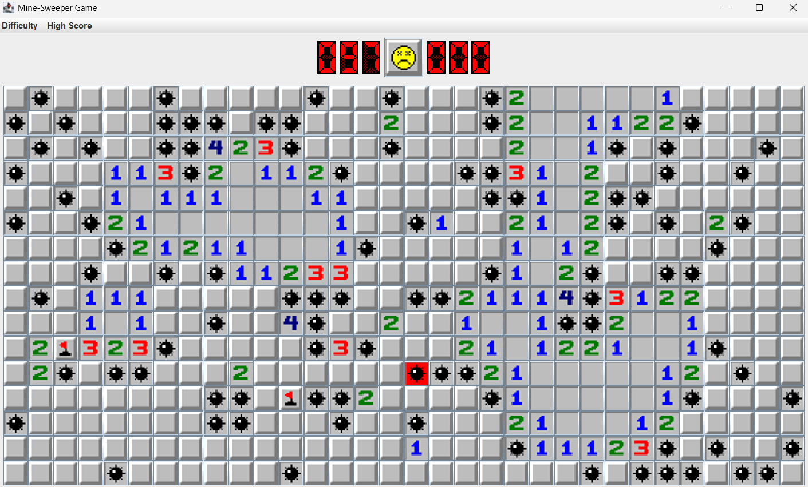

# Minesweeper Game

A desktop implementation of Minesweeper developed in Java using the Swing GUI toolkit. The project applies object-oriented programming, event-driven design, grid-based game logic, and custom image assets.

## Features

- Three difficulty levels: Beginner, Intermediate, and Expert
- Different board sizes and mine counts for each level
- Randomized mine placement
- Left-click cell revealing
- Right-click flag placement
- Adjacent-mine calculation
- Automatic revealing of empty neighbouring cells
- Win and loss detection
- Restart functionality
- Java Swing graphical interface
- Custom sprites

## Technologies

- Java
- Java Swing
- Object-oriented programming
- Event listeners
- Two-dimensional arrays

  ## Difficulty Levels

| Level | Board Size | Number of Mines |
|---|---:|---:|
| Beginner | 9 × 9 | 10 |
| Intermediate | 16 × 16 | 40 |
| Expert | 16 × 30 | 99 |

## Screenshots

### New Game

### Game in Progress

### Game Result

## How to Run

1. Clone the repository.
2. Open the project in an IDE such as IntelliJ IDEA, Eclipse, or Visual Studio Code.
3. Compile the Java source files.
4. Run `Main.java`.
